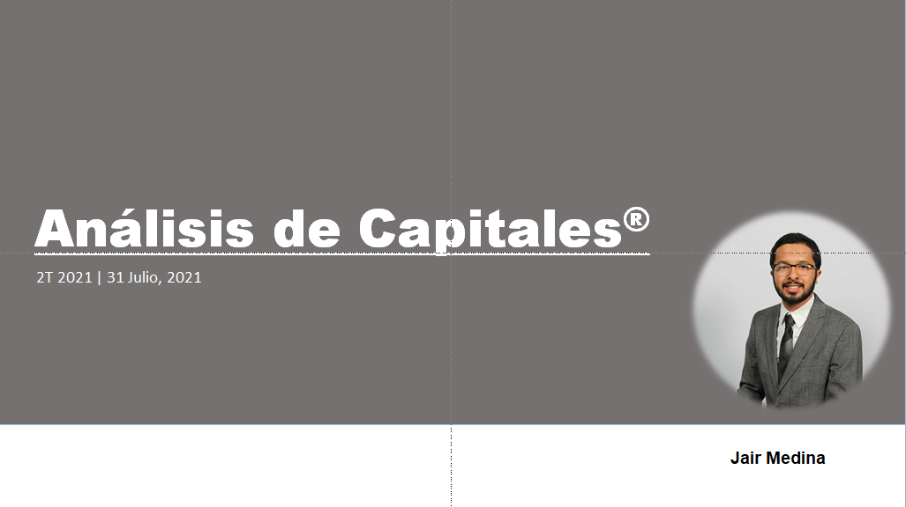

# Equity-Research

This repository contains a pdf file where I explain in spanish how to perform a step by step equity research and financial valuation method using a case study with real financial reports and earnings documents by Amazon.

## Why ? 
This analytical process of assess data can maximize value of every activity and detect where are the key areas of expansion and investment, as engineering and finance students this is an important and reliable way to view data and learn how corporate can take meaningful decisions to innovate and be part of a succesful way of doing business.

#### Data analysis on Financial Statements :dollar:

Valuation guide
- Business description <a id="2">[1]</a>
- Fundamental analysis <a id="2">[2]</a>
- Ratio calculations <a id="2">[3]</a>
- Corporate finance <a id="2">[4]</a>
- Valuation <a id="2">[5]</a>
- Financial modeling <a id="2">[6]</a>
- Technical analysis <a id="2">[7]</a>
- Algorithmic trading <a id="2">[8]</a>

 

